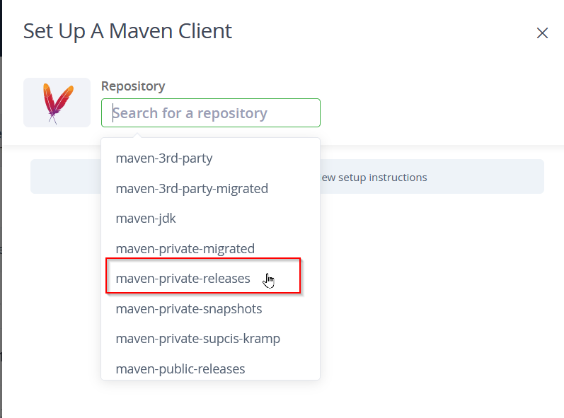

## [$MAVEN_DOWNLOAD_URL] has to be set in environment
Most projects use this plugin to pull dependencies from our internal package repository.

You need to set the right environment variables, here is how:

### Get Token from JFrog

Go to https://repo.sup-logistik.de/ - You may have to login, with either your EL or SuP account.

On the top right, press your account.


Then "Set Me Up":


Select "Maven":


Select the "maven-private-releases" repository:


You may need to enter your password again:


Press Generate Token. Your Token is shown. Press Copy to Copy.


### Set Environment Variables

Next, Set your token in your environment, either in your bash profile (Linux / WSL) or on windows in any terminal:

```
setx MAVEN_DOWNLOAD_URL "https://repo.sup-logistik.de/artifactory/default-maven-virtual"
setx MAVEN_USER "YOUR_USER_HERE"
setx MAVEN_PASSWORD "YOUR_TOKEN_HERE" 
```

Your username is your email, and the token is the previously aquired token from JFrog.

This should now just work!